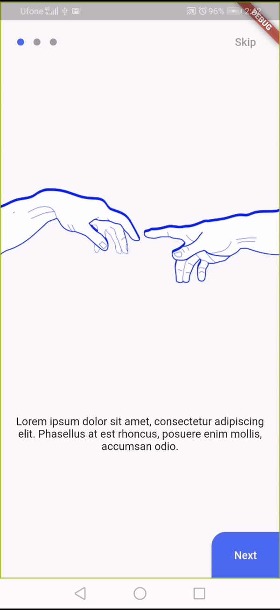

# Minimal Onboarding

[](https://pub.dartlang.org/packages/minimal_onboarding)
[](https://opensource.org/licenses/MIT)
[](https://github.com/xsahil03x/fancy_on_boarding/blob/master/LICENSE)

A quick minimal flutter onboarding

### GIF


## Installation
Add following line in the `dependencies:` section of `pubspec.yaml` file:

```
minimal_boarding: <latest_version>
```
### Import following class
```dart
import 'package:minimal_boarding/minimal_boarding.dart';
```

### Create a list of OnboardingPageModel

```dart
 final onboardingPages = [
    OnboardingPageModel( 'assets/hotels.png', 'Lorem ipsum ...'),
    OnboardingPageModel( 'assets/hotels.png', 'Lorem ipsum ...'),
    OnboardingPageModel( 'assets/hotels.png', 'Lorem ipsum ...'),
];
```

### Use the created list in MinimalOnboarding
```dart
  @override
  Widget build(BuildContext context) {
    return Scaffold(
      body: MinimalBoarding(
        onboardingPages: onboardingPages,
        onFinishButtonPressed: () =>
            Navigator.of(context).pushReplacementNamed('/home'),
        onSkipButtonPressed: () =>
            Navigator.of(context).pushReplacementNamed('/home'),
      ),
    );
  }
```

# License

    Copyright (c) 2018 Sahil Kumar
    
    Permission is hereby granted, free of charge, to any person obtaining a copy of this software and associated documentation files (the "Software"), to deal in the Software without restriction, including without limitation the rights to use, copy, modify, merge, publish, distribute, sublicense, and/or sell copies of the Software, and to permit persons to whom the Software is furnished to do so, subject to the following conditions:
    
    The above copyright notice and this permission notice shall be included in all copies or substantial portions of the Software.
    
    THE SOFTWARE IS PROVIDED "AS IS", WITHOUT WARRANTY OF ANY KIND, EXPRESS OR IMPLIED, INCLUDING BUT NOT LIMITED TO THE WARRANTIES OF MERCHANTABILITY, FITNESS FOR A PARTICULAR PURPOSE AND NONINFRINGEMENT. IN NO EVENT SHALL THE AUTHORS OR COPYRIGHT HOLDERS BE LIABLE FOR ANY CLAIM, DAMAGES OR OTHER LIABILITY, WHETHER IN AN ACTION OF CONTRACT, TORT OR OTHERWISE, ARISING FROM, OUT OF OR IN CONNECTION WITH THE SOFTWARE OR THE USE OR OTHER DEALINGS IN THE SOFTWARE.

## Getting Started

This project is a starting point for a Dart
[package](https://flutter.dev/developing-packages/),
a library module containing code that can be shared easily across
multiple Flutter or Dart projects.

For help getting started with Flutter, view our 
[online documentation](https://flutter.dev/docs), which offers tutorials, 
samples, guidance on mobile development, and a full API reference.
